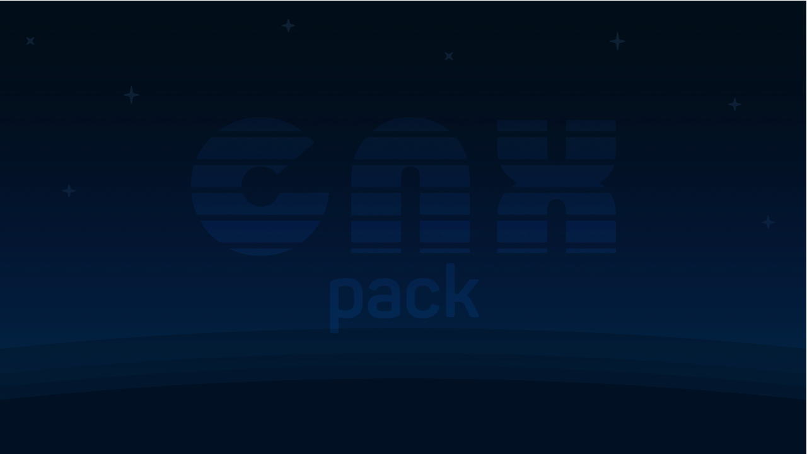
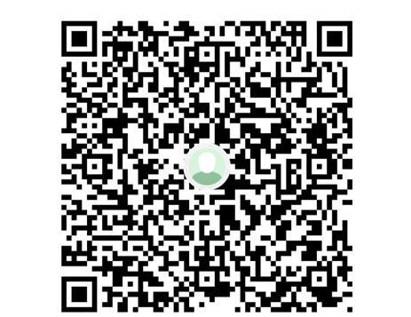

***<h1 align="center">CNX Pack</h1>***

***<h1 align="center">Se o pacote foi utíl para você considere fazer uma doação. Muito Obrigado!</h1>***

  

CNX é um pacote all-in-one (tudo em um) baseado no custom firmware Atmosphère que inclui o hekate/nyx e vários outros homebrews. Assim como o Atmosphère ele não contém arquivos que habilitam pirataria!

## **[FAÇA O DOWNLOAD POR AQUI!](https://github.com/CostelaCNX/cnx/releases/latest)**

## Como instalar
- Formate seu microSD em FAT32 e descompacte o conteúdo do arquivo .zip na raiz.
  - O processo de instalação deste pacote fica mais fácil quando é feito pelo homebrew [CNX Updater](https://github.com/CostelaCNX/cnx-updater).

## Aviso legal
O CostelaBR não detém nenhum direito de cópia sobre nenhum arquivo neste pacote e todo o crédito pertence aos seus respectivos proprietários. Se o atual proprietário de um arquivo presente neste pacote solicitar a remoção de um arquivo, o removeremos imediatamente.

- O CNX, assim como o Atmosphère, não habilita a pirataria no console e seu propósito principal é somente habilitar o usuário a rodar homebrews.
- O uso do CNX com o propósito diferente do mencionado acima, como rodar cópias (backup) de jogos originais, é parcial ou totalmente proibida pela legislação de certos países.
- Ao usar o CNX você está declarando ter consultado sua legislação local e estar legalmente apto a usá-lo com o propósito de rodar cópias (backup) dos seus jogos originais.
- Você está declarando também ser o dono de todos os jogos originais dos quais você fez, faz ou fará cópias (backup).
- O uso do CNX com o propósito diferente do que é permitido pela sua legislação local será feito sob a sua inteira responsabilidade, isentando-se assim a GameMod design.
- O CostelaBR não comercializa ou instala backup de jogos, ROMs de emuladores nem nenhum conteúdo que habilita a pirataria!
- O CostelaBR condena a pirataria. Apoie os desenvolvedores de jogos!

## Agradecimentos especiais
- [atmosphere-NX](https://github.com/atmosphere-NX/Atmosphere/) pelo Atmosphère.
- [CTCaer](https://github.com/CTCaer/hekate/) pelo Hekate e Nyx.
- Todos os outros desenvolvedores que contribuem para a cena Switch.

## 📝 Licença

O nome Nintendo Switch e logo são marcas registradas de [Nintendo](https://github.com/Nintendo). Este repositório não é afiliado a [Nintendo](https://github.com/Nintendo) ou nenhum dos seus parceiros.

The Nintendo Switch names and logos are a trademark of [Nintendo](https://github.com/Nintendo). This repository is in no way affiliated with [Nintendo](https://github.com/Nintendo) or any of its partners.
