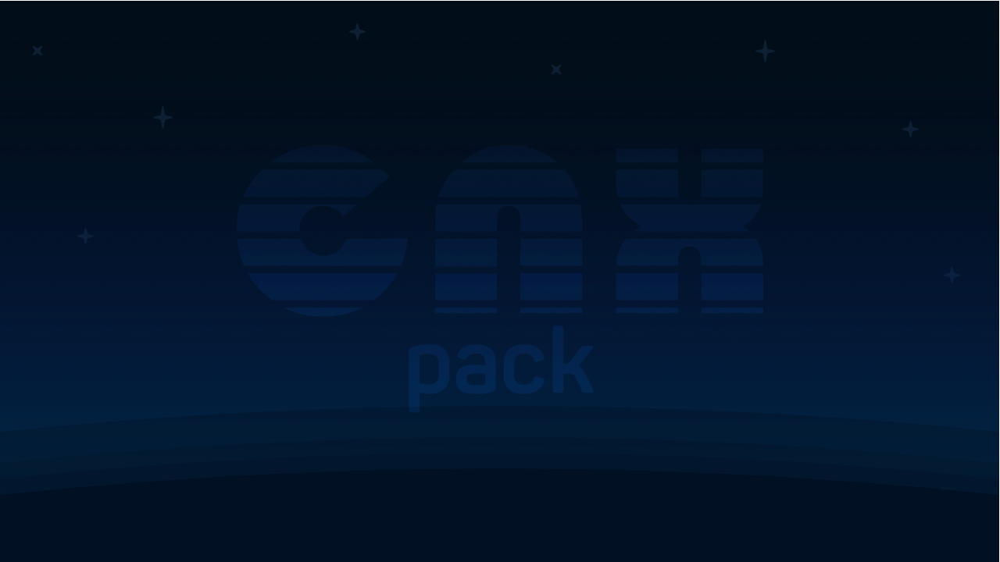
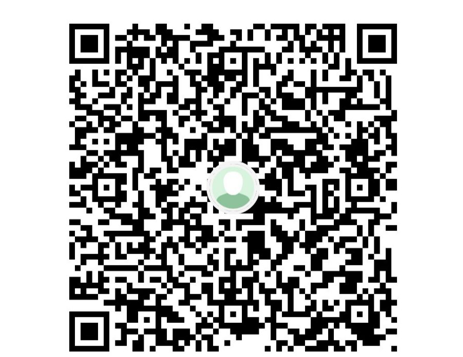

<h1 align="center">CNX Pack</h1>

  

<h1 align="center">Se o pacote foi útil para você considere fazer uma doação. Muito Obrigado!</h1>

  

CNX é um pacote all-in-one (tudo em um) baseado no custom firmware Atmosphère que inclui o hekate/nyx e vários outros homebrews. Assim como o Atmosphère, ele não contém arquivos que habilitam pirataria!

## **[FAÇA O DOWNLOAD POR AQUI!](https://github.com/CostelaCNX/cnx/releases/latest)**

## 📥 Como instalar:

1. **Formate seu microSD** em **FAT32** (use o Hekate ou ferramentas como GUIFormat para cartões >32GB).
2. **Descompacte o conteúdo** do arquivo .zip na raiz do cartão SD.
3. **O processo é mais fácil** quando feito pelos aplicativos **[CNX Installer ou CNX Updater Windows](https://costelabr.xyz/tools.html)**.

---

## 📦 O que está incluído?

### 🔰 BOOTLOADER
- **Hekate**: Bootloader multifuncional essencial. Serve para gerenciar o desbloqueio, criar/gerenciar EmuNAND, fazer backup/restore da NAND, verificar bateria, formatar SD, habilitar/desabilitar AutoRCM e muito mais. É a porta de entrada para todas as funcionalidades do pacote.

### 🌌 CFW (Custom Firmware)
- **Atmosphère**: A base de tudo. O CFW mais estável e completo, que habilita a execução de homebrews, mods e todas as funcionalidades deste pacote.

### 🔧 Homebrews Essenciais
- **DBI**: Instalador avançado com múltiplos modos (MTP, instalador USB, explorador de arquivos). Permite instalar jogos, gerenciar saves e acessar o sistema de arquivos do SD.
- **EdiZon**: Ferramenta completa para cheats e gerenciamento de saves. Integrado com o Ultrahand Menu (L + Dpad Baixo + R3) para ativação rápida de cheats em jogos.
- **JKSV**: Gerenciador robusto de saves. Ideal para fazer backup e restaurar progressos de jogos, incluindo suporte a múltiplos slots de save.
- **NX-Activity-Log**: Monitor detalhado de atividades. Rastreia tempo jogado, sessões e estatísticas de uso para todos os seus jogos.
- **Switch Themes Installer**: Instalador oficial de temas personalizados. **IMPORTANTE**: Use sempre este app para remover temas antes de atualizar o firmware do console.

### 🎨 Personalização & Utilitários
- **Fizeau**: Ajustador de temperatura de cor e filtros de tela. Reduz a luz azul e personaliza as cores da tela do seu Switch.
- **HekateToolbox**: Integra funcionalidades do Hekate no sistema Horizon. Permite ativar/desativar módulos, reiniciar para payloads e mais.
- **Linkalho**: Vincula contas Nintendo locais para jogos que exigem conta. Solução ideal para EmuNAND sem risco de ban.
- **sys-clk-manager**: Interface gráfica para o sys-clk. Ajusta dinamicamente as frequências da CPU/GPU para melhor desempenho ou economia de bateria.
- **Reboot**: Utilitário simples para reiniciar o console de forma rápida e segura.

### 🕹️ Streaming & Controles
- **Moonlight-Switch**: Cliente Moonlight para streaming de jogos da sua PC (via NVIDIA GameStream ou Sunshine).
- **Chiaki**: Cliente PlayStation Remote Play para streaming do PS4/PS5 diretamente no Switch.
- **SysDVR-conf**: Configurador para o SysDVR, permitindo streaming de jogos do Switch para o PC via USB ou rede.
- **sys-con.nro**: Adiciona suporte nativo a controles de outras plataformas (DualShock, DualSense, Xbox) via USB.

### 🛒 Lojas & Conteúdo
- **CNX-Updater**: Atualizador oficial do pacote CNX. Mantém seus homebrews, CFW e traduções sempre atualizados.
- **CNX Toolbox**: Ferramenta para atualizar homebrews e módulos sem a necessidade de atualizar o pacote.
- **NPShop**: Loja alternativa para download e instalação de jogos e homebrews diretamente no console.
- **Sphaira**: Ferramenta de gerenciamento de homebrews e download de conteúdos para o Switch.

### 🛠️ Ferramentas Avançadas
- **AmiiboGenerator**: Gerador de arquivos específicos para certas funcionalidades homebrew.
- **Ultrahand**: Gerenciador de overlays e interfaces para sysmodules.
- **Daybreak**: Instalador seguro de firmware oficial. A única maneira recomendada para atualizar o sistema no Atmosphère.
- **Battery_desync_fix**: Corretor de dessincronização de bateria. Recalibra a leitura da bateria do console quando necessário.

---

## ⚠️ Avisos Importantes

1. **Atualizações de Sistema**: Sempre use o **Daybreak** para atualizar o firmware do sistema. Nunca atualize pela Nintendo.
2. **Temas**: **SEMPRE** remova quaisquer temas instalados usando o **Switch Themes Installer** antes de atualizar o firmware, para evitar semibricks ou erros no seu sistema.
3. **Online na SysNAND**: Para jogar online com jogos originais, use apenas a **SysNAND limpa**. Utilize **EmuNAND** para homebrews e backups.
4. **Bateria**: Use o **battery_desync_fix.nro** apenas se estiver enfrentando problemas graves de calibração de bateria, seguindo as instruções cuidadosamente.

---

## ⚖️ Aviso Legal

O CostelaBR não detém nenhum direito de cópia sobre nenhum arquivo neste pacote e todo o crédito pertence aos seus respectivos proprietários. Se o atual proprietário de um arquivo presente neste pacote solicitar a remoção de um arquivo, o removeremos imediatamente.

- O CNX, assim como o Atmosphère, não habilita a pirataria no console e seu propósito principal é somente habilitar o usuário a rodar homebrews.
- O uso do CNX com o propósito diferente do mencionado acima, como rodar cópias (backup) de jogos originais, é parcial ou totalmente proibida pela legislação de certos países.
- Ao usar o CNX você está declarando ter consultado sua legislação local e estar legalmente apto a usá-lo com o propósito de rodar cópias (backup) dos seus jogos originais.
- Você está declarando também ser o dono de todos os jogos originais dos quais você fez, faz ou fará cópias (backup).
- O uso do CNX com o propósito diferente do que é permitido pela sua legislação local será feito sob a sua inteira responsabilidade.
- O CostelaBR não comercializa ou instala backup de jogos, ROMs de emuladores nem nenhum conteúdo que habilita a pirataria!
- O CostelaBR condena a pirataria. Apoie os desenvolvedores de jogos!

---

## 🙏 Agradecimentos Especiais

- [atmosphere-NX](https://github.com/atmosphere-NX/Atmosphere/) pelo Atmosphère.
- [CTCaer](https://github.com/CTCaer/hekate/) pelo Hekate e Nyx.
- Todos os outros desenvolvedores que contribuem para a cena Switch.

---

## 📝 Licença

O nome Nintendo Switch e logo são marcas registradas de [Nintendo](https://github.com/Nintendo). Este repositório não é afiliado a [Nintendo](https://github.com/Nintendo) ou nenhum dos seus parceiros.

The Nintendo Switch names and logos are a trademark of [Nintendo](https://github.com/Nintendo). This repository is in no way affiliated with [Nintendo](https://github.com/Nintendo) or any of its partners.
